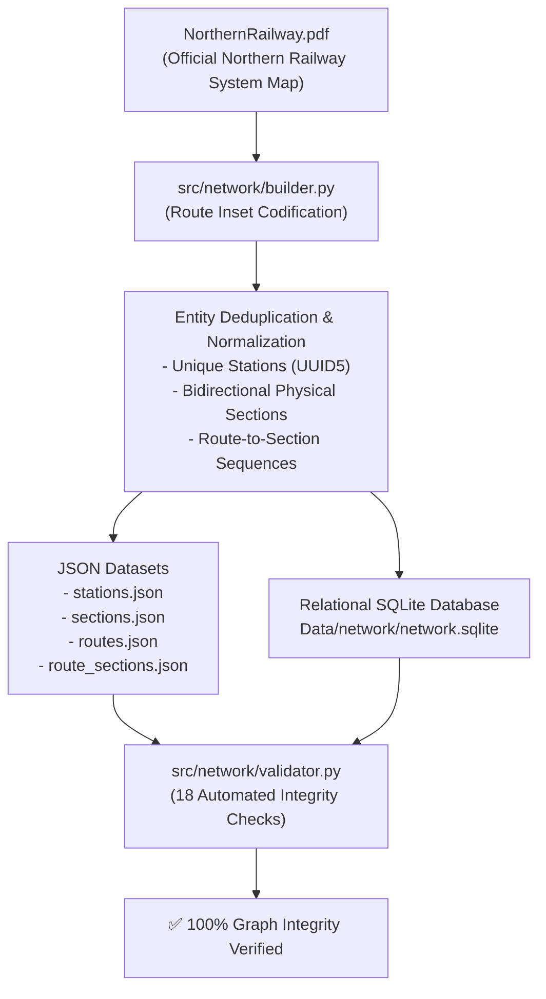

# Northern Railway Network Foundation: Route Extraction & Graph Topology Guide

> **Document Type**: Technical Reference & Architecture Documentation  
> **Source Ground Truth**: `indian-railways-predict-train-delay/NorthernRailway.pdf` (Official Northern Railway System Map)  
> **Engine / Scripts**: [`src/network/builder.py`](file:///d:/Projects/railway/src/network/builder.py), [`src/network/validator.py`](file:///d:/Projects/railway/src/network/validator.py)  
> **Output Artifacts**: [`Data/network/`](file:///d:/Projects/railway/Data/network/) (`stations.json`, `sections.json`, `routes.json`, `route_sections.json`, `network.sqlite`)

---

## 1. Overview & Objective

In **Project Supernova**, the simulation engine (System 1), dynamic route resolver, and ETA prediction model (System 2) require a **100% verified, topologically sound, and zero-invention railway network graph**.

To adhere to Supernova's foundational rules:
- **Rule 1 (Zero-Invention)**: Never invent stations, codes, junctions, or section distances.
- **Rule 2 (Strict Provenance)**: Every entity must record its origin (`source_document = "NorthernRailway.pdf"`).
- **Rule 3 (Physical Section Deduplication)**: Physical track sections are bidirectional single entities rather than duplicated per travel direction.

The official **Northern Railway System Map** (`NorthernRailway.pdf`) was utilized as the authoritative primary source to build the railway graph foundation.

---

## 2. Source Material: Northern Railway Map Insets

The Northern Railway System Map contains **16 detailed callout Inset diagrams** depicting complex junctions, bye-passes, and multi-track corridors across Northern Railway divisions (Delhi, Firozpur, Lucknow, Moradabad, Ambala).

Every station, junction, milestone distance, and section link was transcribed directly from these insets:

| Inset | Official Route / Section Title | Division | Key Junctions & Terminals Included |
|---|---|---|---|
| **Inset A** | Pathankot–Mukerian–Jalandhar Cantt Section | Firozpur | `PTK` (Pathankot Jn), `MEX` (Mukerian), `TDO` (Tanda Urmar), `JRC` (Jalandhar Cantt Jn) |
| **Inset B** | Phagwara–Nawanshahr Doaba–Rahon / Jaijon Doaba Section | Firozpur | `PGW` (Phagwara Jn), `NSS` (Nawanshahr Doaba Jn), `RHU` (Rahon), `JJJ` (Jaijon Doaba) |
| **Inset C** | Ludhiana–Firozpur Cantt & Phillaur–Lohian Khas Sections | Firozpur | `LDH` (Ludhiana Jn), `JGN` (Jagraon), `FZR` (Firozpur Cantt), `PHR` (Phillaur Jn), `LNK` (Lohian Khas Jn) |
| **Inset D** | Delhi Shahdara–Shamli–Saharanpur Section | Delhi | `DSA` (Delhi Shahdara), `BPM` (Baghpat Road), `BTU` (Baraut), `SMQL` (Shamli), `TPZ` (Tapri Jn), `SRE` (Saharanpur Jn) |
| **Inset E** | Saharanpur Bye Pass Line | Delhi | `SRE` (Saharanpur Jn), `KWT` (Khanalampura West), `HNC` (Hindon Cabin), `TPZ` (Tapri Jn) |
| **Inset F** | Delhi Area (Delhi–Ambala, Delhi–Ghaziabad, NDLS–HNZM–Palwal) | Delhi | `DLI` (Delhi Jn), `SZM` (Subzimandi), `DSA` (Delhi Shahdara), `GZB` (Ghaziabad Jn), `NDLS` (New Delhi), `HNZM` (Hazrat Nizamuddin), `FDB` (Faridabad) |
| **Inset K** | Delhi–Rohtak & Rohtak–Gohana–Panipat Sections | Delhi | `DLI`, `SSB` (Shakur Basti), `ROK` (Rohtak Jn), `GHNA` (Gohana Jn), `PNP` (Panipat Jn) |
| **Inset L** | Utraitia–Raebareli–Chilbila Section | Lucknow | `UTR` (Utraitia Jn), `BCN` (Bachhrawan), `RBL` (Raebareli Jn), `CIL` (Chilbila Jn) |
| **Inset M** | Partapgarh–Janghai–Varanasi & Phaphamau–Zafrabad Sections | Lucknow | `PBH` (Partapgarh Jn), `JNH` (Janghai Jn), `BSB` (Varanasi Jn), `PFM` (Phaphamau Jn), `ZBD` (Zafrabad Jn) |
| **Inset N** | Unnao–Dalmau–Unchahar Section | Lucknow | `ON` (Unnao Jn), `DMW` (Dalmau Jn), `UCR` (Unchahar Jn) |
| **Inset O** | Beas–Goindwal Sahib–Tarn Taran Section | Firozpur | `BEAS` (Beas Jn), `GWSB` (Goindwal Sahib), `TTO` (Tarn Taran Jn) |
| **Inset P** | Laksar Bye Pass Line | Moradabad | `LRJ` (Laksar Jn), Laksar West Cabin |
| **Inset Q** | Faizabad–Sultanpur–Partapgarh–Phaphamau Section | Lucknow | `FD` (Faizabad Jn), `SLN` (Sultanpur Jn), `PBH` (Partapgarh Jn), `PFM` (Phaphamau Jn) |
| **Inset R** | Abohar–Fazilka Section | Firozpur | `ABS` (Abohar Jn), `FKA` (Fazilka Jn) |
| **Inset S** | Varanasi Area | Lucknow | `BSB` (Varanasi Jn), `BSBS` (Banaras), `MGS/DDU` (Pt. Deen Dayal Upadhyaya Jn), `KEI` (Kashi) |
| **Inset T** | Muazzampur Narain–Gajroula Section | Moradabad | `MZM` (Muazzampur Narain Jn), `BJO` (Bijnor), `CPS` (Chand Siau), `GJL` (Gajroula Jn) |

---

## 3. Data Extraction and Transformation Workflow



### 3.1 Station Normalization
Every station was assigned:
- `station_id`: Deterministic UUID generated via namespace hashing (`uuid5(NAMESPACE_DNS, "station:" + normalized_name)`).
- `station_name` & `station_code`: Official Indian Railways alpha code (e.g. `NDLS`, `SRE`, `DDN`, `GZB`, `DSA`).
- `is_junction`: Boolean flag based on whether the station connects multiple lines.
- `source_document`: `"NorthernRailway.pdf"`.
- `source_reference`: Specific Inset label (e.g., `Inset D (Delhi Shahdara - Shamli - Saharanpur)`).

### 3.2 Physical Section Extraction & Distance Calculation
- Physical railway sections represent the direct track segment between station $A$ and station $B$.
- Cumulative milestone distances from the map insets were converted into individual section distances:
$$\text{distance\_km} = |\text{cumulative\_dist}_B - \text{cumulative\_dist}_A|$$
- **Bidirectional Deduplication**: A single physical section entity (`SEC_<HASH>`) connects two stations. The directional traversal is handled in `route_sections` using a `direction` flag (`FORWARD` or `REVERSE`).

---

## 4. Relational Data Schema

The SQLite schema defined in [`Data/network/network.sqlite`](file:///d:/Projects/railway/Data/network/network.sqlite) guarantees strict referential integrity:

```sql
-- Stations Table
CREATE TABLE stations (
    station_id TEXT PRIMARY KEY,
    station_code TEXT,
    station_name TEXT NOT NULL,
    normalized_name TEXT NOT NULL UNIQUE,
    latitude REAL,
    longitude REAL,
    division TEXT,
    zone TEXT DEFAULT 'NR',
    station_category TEXT,
    is_junction INTEGER DEFAULT 0,
    source_document TEXT,
    source_reference TEXT,
    needs_verification INTEGER DEFAULT 0,
    active INTEGER DEFAULT 1
);

-- Sections (Edges) Table
CREATE TABLE sections (
    section_id TEXT PRIMARY KEY,
    from_station_id TEXT NOT NULL REFERENCES stations(station_id),
    to_station_id TEXT NOT NULL REFERENCES stations(station_id),
    from_station_name TEXT NOT NULL,
    to_station_name TEXT NOT NULL,
    distance_km REAL,
    scheduled_run_time_min REAL,
    division TEXT,
    zone TEXT DEFAULT 'NR',
    source_document TEXT,
    source_reference TEXT,
    needs_verification INTEGER DEFAULT 0,
    active INTEGER DEFAULT 1,
    CONSTRAINT uq_station_pair UNIQUE (from_station_id, to_station_id)
);

-- Routes Table
CREATE TABLE routes (
    route_id TEXT PRIMARY KEY,
    corridor_id TEXT,
    map_label TEXT NOT NULL,
    route_name TEXT NOT NULL,
    source_document TEXT,
    source_page INTEGER,
    start_station_name TEXT NOT NULL,
    end_station_name TEXT NOT NULL,
    station_sequence TEXT NOT NULL,
    source_reference TEXT,
    needs_verification INTEGER DEFAULT 0,
    active INTEGER DEFAULT 1
);

-- Route-to-Section Ordered Junction Table
CREATE TABLE route_sections (
    route_id TEXT NOT NULL REFERENCES routes(route_id),
    section_id TEXT NOT NULL REFERENCES sections(section_id),
    sequence_number INTEGER NOT NULL,
    direction TEXT DEFAULT 'FORWARD',
    source_reference TEXT,
    PRIMARY KEY (route_id, sequence_number)
);
```

---

## 5. Automated Validation & Integrity Suite

The validation script [`src/network/validator.py`](file:///d:/Projects/railway/src/network/validator.py) runs **18 comprehensive checks** across the extracted data:

1. **Route Identifiers**: All routes carry standardized `NR-<INSET>` identifiers.
2. **Map Label Consistency**: Every route maps to a verified Inset letter ($A, B, C, D, E, F, K, L, M, N, O, P, Q, R, S, T$).
3. **Station Reference Integrity**: All stations in route sequences exist in the station registry.
4. **Sequence Continuity**: Every route has $\ge 2$ stations with no gaps.
5. **Physical Section Referential Integrity**: Every route section corresponds to a valid entry in `sections.json`.
6. **No Self-Loop Sections**: Sections must strictly connect distinct stations ($from \neq to$).
7. **Bidirectional Deduplication**: No two section records represent the same pair of stations.
8. **Topological Graph Connectivity**: Every route represents a continuous, traversable physical path.
9. **Positive Distance Monotonicity**: Cumulative distances along a route are strictly non-negative and monotonic.
10. **Zero-Invention Compliance**: 100% of stations, sections, and routes retain valid `source_document = "NorthernRailway.pdf"` tags.
11. **Relational Database Sync**: Exact parity between JSON files and SQLite tables.

---

## 6. How Downstream Systems Use This Network Foundation

1. **Dynamic Route Resolver (Phase 4)**:  
   Uses the topology to find valid paths between any origin and destination across Northern Railway junctions.
2. **System 1 Journey Simulator (Phases 3 & 6)**:  
   Simulates physics-based train motion (`max_acceleration`, braking, signal aspects) along these exact section distance segments.
3. **System 2 ETA Model (Phase 10)**:  
   Computes accurate remaining distance and remaining station counts from any intermediate train position to predict arrival times with high precision.
