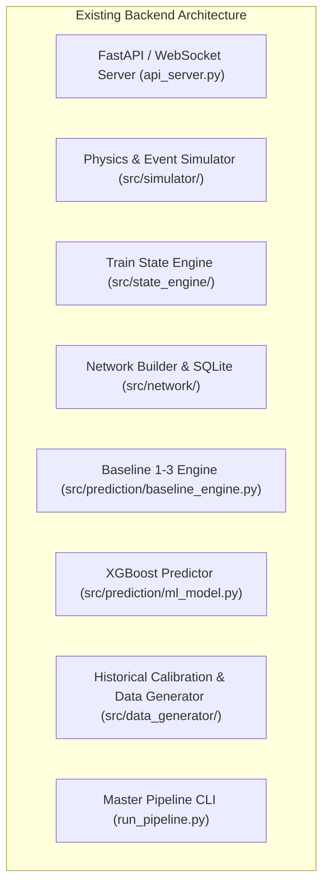

# SUPERNOVA — Phase 0: Backend Architecture Audit & System Contract

> **Document**: Phase 0 Deliverable (`backend_audit.md`)  
> **Status**: Completed  
> **Reference Standard**: [`phase_by_phase.md`](file:///d:/Projects/railway/phase_by_phase.md) (Lines 380–418)

---

## 1. Existing Backend Components Analysis

The current backend repository contains a modular Python ecosystem with simulation, prediction, baseline estimation, feature pipelines, and FastAPI server layers.



### Component Inventory Table

| Component / Subsystem | Primary Files / Paths | Current Purpose & Behavior |
|---|---|---|
| **API Server** | [`api_server.py`](file:///d:/Projects/railway/api_server.py) | FastAPI application with WebSocket `/ws/live`, REST endpoints (`/api/historical-context`, `/api/simulation/configure`, `/api/metrics`), and static file serving for React frontend. |
| **Pipeline Runner** | [`run_pipeline.py`](file:///d:/Projects/railway/run_pipeline.py) | Master CLI script executing simulation, baseline evaluation, ML training, comparative benchmarking, and Excel reporting. |
| **Network Foundation** | [`src/network/builder.py`](file:///d:/Projects/railway/src/network/builder.py), [`src/network/validator.py`](file:///d:/Projects/railway/src/network/validator.py) | Extracted Northern Railway insets from `NorthernRailway.pdf` into SQLite schema (`stations`, `sections`, `routes`, `route_sections`). |
| **Route Definitions** | [`Data/routes/`](file:///d:/Projects/railway/Data/routes/) | Static route JSON definitions for Delhi–Dehradun, Delhi–Agra, Delhi–Lucknow. |
| **Simulator Core** | [`src/simulator/`](file:///d:/Projects/railway/src/simulator/) | 30-second discrete timestep simulation with acceleration/braking physics, speed controller, event injecters (signals, congestion, weather). |
| **Train State Engine** | [`src/state_engine/`](file:///d:/Projects/railway/src/state_engine/) | Processes telemetry/events to maintain real-time kinematic and delay state. |
| **Historical Analytics** | [`src/data_generator/`](file:///d:/Projects/railway/src/data_generator/) | Audits historical Kaggle data, computes seasonal fog/congestion probabilities into `config/historical_calibration.json`. |
| **Baseline Predictor** | [`src/prediction/baseline_engine.py`](file:///d:/Projects/railway/src/prediction/baseline_engine.py) | Implements Baseline 1 (Static Scheduled), Baseline 2 (Current Delay Extrapolation), Baseline 3 (Historical Section Speeds). |
| **ML Predictor (XGBoost)** | [`src/prediction/ml_model.py`](file:///d:/Projects/railway/src/prediction/ml_model.py), [`models/xgboost_eta_model.pkl`](file:///d:/Projects/railway/models/xgboost_eta_model.pkl) | Regresses remaining journey travel time using gradient boosting. |
| **Evaluation Suite** | [`src/prediction/evaluator.py`](file:///d:/Projects/railway/src/prediction/evaluator.py), [`src/prediction/ml_evaluator.py`](file:///d:/Projects/railway/src/prediction/ml_evaluator.py) | Computes MAE, RMSE, MAPE, Accuracy within ±15 min, generates JSON and Markdown benchmark reports. |

---

## 2. Components to Keep

These components are well-aligned with the master specification in `phase_by_phase.md`:

1. **Topological Network Foundation** ([`src/network/`](file:///d:/Projects/railway/src/network/)):
   - Complete station, section, and route database with zero-invention provenance from `NorthernRailway.pdf`.
2. **Kinematic Physics Engine** ([`src/simulator/physics/`](file:///d:/Projects/railway/src/simulator/physics/)):
   - Acceleration, service braking, emergency braking equations and sectional speed restriction logic.
3. **Core Metric Calculators** ([`src/prediction/metrics.py`](file:///d:/Projects/railway/src/prediction/metrics.py)):
   - Standard regression metrics (MAE, RMSE, Error Distributions, Under/Over prediction bias).
4. **FastAPI Server Infrastructure** ([`api_server.py`](file:///d:/Projects/railway/api_server.py)):
   - Async event loop, WebSocket live streaming architecture, and CORS configuration.

---

## 3. Components to Modify

To strictly conform to the 21-phase master plan in `phase_by_phase.md`, the following components require targeted refactoring:

1. **`api_server.py` Data & Simulation Mocking**:
   - *Current issue*: Hardcodes simulated delays (`SECTION_REASONS`, `sys3_action`) and synthetic fallbacks directly inside the API module.
   - *Target state*: Purely invoke decoupled services (Dynamic Route Resolver, System 2 Live Inference, Observation Provider).
2. **`src/prediction/ml_model.py` Dataset Loading & Provenance**:
   - *Current issue*: Implicit mixture of synthetic simulation output and static files without explicit `data_origin` metadata.
   - *Target state*: Enforce strict `data_origin` tags (`kaggle`, `synthetic`, `observed`, `realtime`) and prevent snapshot journey leakage during train/val split.
3. **`src/data_generator/dataset_builder.py`**:
   - *Current issue*: Over-relies on pre-canned route configs.
   - *Target state*: Use the Phase 4 Dynamic Route Resolver for arbitrary origin-destination trajectory synthesis.

---

## 4. Components to Add (New Modules Required)

As outlined in `phase_by_phase.md`, the following new modules will be built strictly in their respective phases:

1. **Phase 4: Dynamic Route Resolver (`src/network/resolver.py`)**:
   - Function `resolve_route(origin_station, destination_station)` returning ordered stations, sections, distances, and handling branch ambiguities.
2. **Phase 5: Historical Behavior Service (`src/features/historical_behavior_service.py`)**:
   - Empirical distribution engine representing $P(\text{travel\_time} \mid \text{route}, \text{train\_type}, \text{context})$ learned from Kaggle data without arbitrary hardcoded constants.
3. **Phase 8: ETA Dataset Generator (`src/features/eta_dataset_generator.py`)**:
   - Formal snapshot generator converting continuous trajectories into ETA training opportunities with `actual_remaining_travel_time_minutes` ground truth.
4. **Phase 12: Observation Provider Abstraction (`src/live/observation_provider.py` & `RailRadarObservationProvider`)**:
   - Pluggable live observation ingestion layer with server-side payload caching and provenance tags.
5. **Phase 13: Live Journey Reconstruction (`src/live/journey_matcher.py`)**:
   - Map matching algorithm aligning noisy GPS observations against the physical network graph.
6. **Phase 16: Closed-Loop Calibration Engine (`src/calibration/calibrator.py`)**:
   - Feedback analyzer that updates simulator distributions or System 2 feature scales based on real-world error logs.

---

## 5. Existing Technical Debt & Architectural Risks

| Risk Area | Specific Observation | Required Remediation |
|---|---|---|
| **System 3 Over-Coupling** | "System 3 Decision Engine" is referenced in comments and UI payload in `api_server.py`. | Master plan explicitly states: *System 3 is NOT part of core architecture*. Remove or decouple operational advice from core ETA predictor. |
| **Kaggle Target vs ETA Target** | Kaggle baseline and System 2 synthetic ETA target were previously conflated. | Enforce strict separation: Kaggle baseline evaluates only Kaggle-native targets; System 2 evaluates `actual_remaining_travel_time_minutes`. |
| **Leakage in Validation Splits** | Splitting 30-second trajectory rows randomly leads to temporal data leakage across the same journey. | Group-by-journey (`journey_id`) chronological K-Fold / train-test separation in Phase 11. |
| **Hardcoded Route Dictionaries** | `ROUTE_START_TIMES` and `SECTION_REASONS` hardcoded to 3 routes (Agra, Dehradun, Lucknow). | Transition to dynamic graph lookup and historical probability lookup. |

---

## 6. Existing API Contracts

### Current Endpoints (`api_server.py`)

| Endpoint | Method | Input Parameters | Output Response Structure |
|---|---|---|---|
| `/api/historical-context` | `GET` | `month: str`, `route: str` | `{ month, season, region, departure_time, historical_fog_risk_pct, historical_congestion_risk_pct, mean_delay_fog_min, reliability }` |
| `/api/simulation/configure` | `POST` | `month: str` | `{ status: "CONFIGURED", selected_month, season, timestamp }` |
| `/api/metrics` | `GET` | None | `{ mae: float, rmse: float, mape: float, accuracy: float }` |
| `/ws/live` | `WebSocket` | Text JSON: `{"type": "SET_MONTH", "month": "..."}` | Stream JSON: `{"type": "LIVE_TRAINS", "selected_month": "...", "data": [TrainState, ...]}` |

### Target Standardized Endpoints (Phase 20 Contract)

- `POST /routes/resolve` — Graph resolution for arbitrary station pairs
- `GET /trains/{train_id}/state` — Unified kinematic state
- `POST /simulation/journey` — System 1 synthetic trajectory generator
- `POST /eta/predict` — System 2 remaining travel time inference
- `POST /observations/railradar` — External observation ingestion
- `GET /validation/{journey_id}` — Actual vs Predicted audit
- `GET /calibration/report` — Real-world error drift & parameter updates

---

## 7. Existing Database Structures

The existing SQLite network database is located at [`Data/network/network.sqlite`](file:///d:/Projects/railway/Data/network/network.sqlite).

### Entity-Relationship Structure:

```
┌─────────────────────────┐           ┌──────────────────────────────────┐
│        stations         │           │             sections             │
├─────────────────────────┤           ├──────────────────────────────────┤
│ station_id (PK)         │◄───┐ ┌───►│ section_id (PK)                  │
│ station_code            │    │ │    │ from_station_id (FK -> stations) │
│ station_name            │    └─┼───-│ to_station_id (FK -> stations)   │
│ normalized_name         │      │    │ from_station_name                │
│ latitude, longitude     │      │    │ to_station_name                  │
│ division, zone          │      │    │ distance_km                      │
│ is_junction (0/1)       │      │    │ scheduled_run_time_min           │
│ source_document         │      │    │ source_document                  │
└─────────────────────────┘      │    └──────────────────────────────────┘
             ▲                   │                      ▲
             │                   │                      │
             │                   │                      │
┌────────────┴────────────┐      │    ┌─────────────────┴────────────────┐
│         routes          │      │    │          route_sections          │
├─────────────────────────┤      │    ├──────────────────────────────────┤
│ route_id (PK)           │      └───-│ route_id (FK -> routes)          │
│ corridor_id             │           │ section_id (FK -> sections)      │
│ map_label               │           │ sequence_number (PK)             │
│ route_name              │           │ direction (FORWARD/REVERSE)      │
│ start_station_name      │           │ source_reference                 │
│ end_station_name        │           └──────────────────────────────────┘
│ station_sequence (JSON) │
└─────────────────────────┘
```

---

## 8. Phase 0 Audit Conclusion & Next Steps

1. **System Health**: The backend codebase is modular and contains a solid physics engine and verified network topology.
2. **Key Refactoring Mandate**: Decouple hardcoded route scripts and ensure strict `data_origin` tagging and leakage prevention.
3. **Driver Approval Gate**: Phase 0 deliverable ([`backend_audit.md`](file:///d:/Projects/railway/backend_audit.md)) is complete. We are ready for your review and approval before proceeding to **Phase 1 (Kaggle Data Audit)**.
