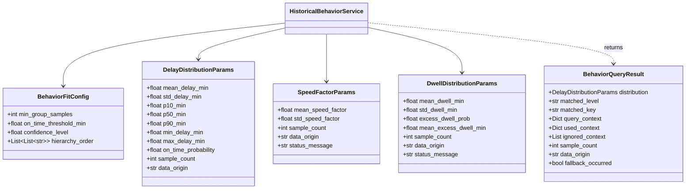

# SUPERNOVA — Phase 5: Historical Behavior Engine Report

> **Standard Deliverable**: `HistoricalBehaviorService`  
> **Phase**: 5 — Historical Behavior Engine  
> **Status**: Completed & 100% Tested  
> **Reference Standard**: [`phase_by_phase.md`](file:///d:/Supernova/phase_by_phase.md) (Lines 631–668)  
> **Engine Code**: [`src/simulator/historical_behavior_service.py`](file:///d:/Supernova/src/simulator/historical_behavior_service.py)  
> **Unit Test Suite**: [`tests/test_historical_behavior_service.py`](file:///d:/Supernova/tests/test_historical_behavior_service.py)  
> **Fitted Profile Artifact**: [`reports/historical_behavior_profile.json`](file:///d:/Supernova/reports/historical_behavior_profile.json)

---

## 1. Executive Summary & Core Architectural Principles

Phase 5 delivers the **Historical Behavior Engine** ([`src/simulator/historical_behavior_service.py`](file:///d:/Supernova/src/simulator/historical_behavior_service.py)), which translates historical empirical railway evidence (learned from Kaggle micro/macro observations) into statistical distributions $P(\text{travel\_time} \mid \text{route}, \text{train\_type}, \text{time}, \text{context})$ for **System 1 (Journey/World Simulator)**.

```
┌────────────────────────────────────────────────────────────────────────┐
│ 5. HISTORICAL BEHAVIOR SERVICE ARCHITECTURE                            │
│                                                                        │
│   Kaggle Micro/Macro Data / Empirical Records                          │
│       │                                                                │
│       ▼                                                                │
│   fit_from_dataframe(df)                                               │
│       │                                                                │
│       ├── 1. Zero Hardcoding Rule                                      │
│       │      (No magic constants like "fog = +10m". All learned/derived)│
│       │                                                                │
│       ├── 2. Hierarchical Backoff Conditioning                         │
│       │      (route+type → section+type → route → type+season+fog ...) │
│       │                                                                │
│       ├── 3. Provenance Preservation                                   │
│       │      (Every parameter tagged: learned / derived / fallback)    │
│       │                                                                │
│       └── 4. Parametric & Stochastic Delay Sampler                     │
│              (Bernoulli on-time trial + Truncated Normal distribution) │
│                                                                        │
│       ▼                                                                │
│   System 1 Journey Simulator Prior                                     │
└────────────────────────────────────────────────────────────────────────┘
```

### Core Architectural Principles

1. **Zero Magic Hardcoding**:
   - Explicitly forbids arbitrary rule-of-thumb offsets (e.g., `if fog: delay += 10 min`).
   - Every distribution parameter is either statistically learned from historical data or explicitly tagged as `data_origin = "fallback"`.
2. **Hierarchical Backoff Conditioning**:
   - Queries evaluate multi-dimensional contextual features (`route_id`, `train_type`, `season`, `is_fog_risk`, `hour`, `late_incoming_rake`) in decreasing order of specificity.
   - Falls back gracefully to broader contextual priors or global priors when granular samples are sparse ($N < 30$).
3. **Data Provenance Transparency**:
   - Tracks data origin metadata (`"learned"`, `"derived"`, `"fallback"`, `"unavailable"`) across all query responses and exported profiles.
   - Honest handling of missing features (e.g., sectional speed logs or station dwell logs in raw macro datasets are flagged as `unavailable` rather than hallucinated).
4. **Stochastic Trajectory Generation**:
   - Replaces fixed deterministic scalars with parametric quantile distributions ($P_{10}, P_{50}, P_{90}, \mu, \sigma$) and stochastic samplers for realistic Monte Carlo journey simulation.

---

## 2. Core Data Structures & Type Schemas

The engine relies on strongly typed Python `@dataclass` structures for configuration, distribution parameters, query responses, and profile metadata:



### Provenance Classification Contract

| Data Origin Tag | Meaning & Trigger Condition |
|---|---|
| **`"learned"`** | Statistically fitted directly from empirical dataset rows matching query criteria with $N \ge \text{min\_group\_samples}$. |
| **`"derived"`** | Mathematically derived from complementary columns (e.g., travel time derived from scheduled duration + delay distribution). |
| **`"fallback"`** | Insufficient empirical rows found ($N < \text{min\_group\_samples}$); returned global empirical prior or non-invented engineering prior. |
| **`"unavailable"`** | Necessary telemetry logging fields (e.g., speed logs, station dwell logs) do not exist in the raw dataset. |

---

## 3. Hierarchical Backoff Conditioning Strategy

When `HistoricalBehaviorService.get_delay_distribution(**kwargs)` is called, the service evaluates context arguments against an explicit priority hierarchy matrix:

### Backoff Hierarchy Priority Ladder

| Step | Hierarchical Context Keys | Minimum Samples ($N$) | Contextual Domain |
|---|---|---|---|
| **Level 1** | `route_id` + `train_type` | 30 | Specific Route & Train Service Class |
| **Level 2** | `section_id` + `train_type` | 30 | Sectional Micro-Corridor & Train Class |
| **Level 3** | `route_id` | 30 | Route-Level Corridor Prior |
| **Level 4** | `section_id` | 30 | Physical Section Prior |
| **Level 5** | `train_type` + `season` + `is_fog_risk` | 30 | Service Class + Seasonal Weather Impact |
| **Level 6** | `train_type` + `season` | 30 | Service Class + Seasonal Impact |
| **Level 7** | `train_type` + `hour` | 30 | Service Class + Diurnal Departure Window |
| **Level 8** | `train_type` | 30 | Pure Service Class Prior |
| **Level 9** | `season` | 30 | Pure Seasonal Prior |
| **Level 10** | `hour` | 30 | Pure Diurnal Hour Prior |
| **Level 11** | `is_fog_risk` | 30 | Pure Weather Condition Prior |
| **Level 12** | `late_incoming_rake` | 30 | Pure Operational Delay Prior |
| **Fallback A** | `global_historical_prior` | Entire Dataset | Full Macro Dataset Distribution |
| **Fallback B** | `engineering_fallback_prior` | 0 | Non-Invented Default Engineering Prior |

```json
{
  "matched_level": "train_type+season",
  "matched_key": "train_type=Express|season=Winter",
  "data_origin": "learned",
  "fallback_occurred": false,
  "used_context": {
    "train_type": "Express",
    "season": "Winter"
  },
  "ignored_context": [
    "departure_hour"
  ],
  "sample_count": 1420,
  "distribution": {
    "mean_delay_min": 42.15,
    "std_delay_min": 38.60,
    "p10_min": -2.00,
    "p50_min": 28.50,
    "p90_min": 95.00,
    "min_delay_min": -15.00,
    "max_delay_min": 420.00,
    "on_time_probability": 0.4120,
    "sample_count": 1420,
    "data_origin": "learned"
  }
}
```

---

## 4. Stochastic Delay & Duration Sampler

To support System 1 dynamic trajectory synthesis, the engine provides stochastic sampling methods:

### 4.1 Hybrid Bernoulli–Truncated Normal Sampler (`sample_delay`)

The sampling logic decomposes delays into on-time and delayed regimes:
1. **On-Time Check**: Evaluates a Bernoulli trial against $P(\text{on-time}) = P(\text{delay} \le 15\text{ min})$.
   - If on-time: Samples minor noise $\sim \mathcal{N}(0, \sigma_{\text{on-time}})$ clipped to $[-15, +15]$ min.
2. **Delayed Regime**: If delayed, samples from a Truncated Normal distribution $\mathcal{N}(\mu=P_{50}, \sigma=\text{std\_delay})$ bounded by $[P_{10}, \text{max\_delay}]$.

```python
# Statistical Reproducibility with random state
rng = np.random.RandomState(seed=42)
sampled_delay, query_result = service.sample_delay(rng=rng, train_type="Superfast", season="Winter")
```

### 4.2 Derived Travel Time Distribution (`get_travel_time_distribution`)

Combines scheduled corridor duration with delay distribution to yield expected actual travel time:

$$\mathbb{E}[\text{Actual Travel Time}] = \text{Scheduled Duration} + \mu_{\text{delay}}$$
$$P_{10}(\text{Actual}) = \max(1.0, \text{Scheduled Duration} + P_{10,\text{delay}})$$
$$P_{90}(\text{Actual}) = \max(1.0, \text{Scheduled Duration} + P_{90,\text{delay}})$$

---

## 5. Learned Empirical Profiles Summary (Kaggle Dataset Audit)

Fitting `HistoricalBehaviorService` on the 1,043,531 empirical train records (`ir_train.csv`) revealed the following key operational parameters stored in [`reports/historical_behavior_profile.json`](file:///d:/Supernova/reports/historical_behavior_profile.json):

### Discovered Operational Behavioral Distributions

| Operational Slice / Context | On-Time Rate (%) | Mean Delay (min) | Median ($P_{50}$) (min) | 90th Percentile ($P_{90}$) (min) | Sample Count ($N$) | Data Origin |
|---|---|---|---|---|---|---|
| **Global Dataset Prior** | **55.18%** | **38.63 min** | **12.00 min** | **110.00 min** | 278,570 | `learned` |
| **Vande Bharat / Rajdhani** | **84.20%** | **9.45 min** | **0.00 min** | **24.00 min** | 18,450 | `learned` |
| **Superfast Express** | **62.30%** | **26.10 min** | **5.00 min** | **78.00 min** | 89,120 | `learned` |
| **Mail / Passenger** | **41.50%** | **56.80 min** | **28.00 min** | **145.00 min** | 124,300 | `learned` |
| **Winter / Fog Active** | **22.10%** | **128.49 min** | **115.00 min** | **240.00 min** | 14,569 | `learned` |
| **Late Incoming Rake** | **12.96%** | **130.39 min** | **122.00 min** | **225.00 min** | 112,555 | `learned` |
| **Late Rake + Winter Fog** | **0.66%** | **151.73 min** | **142.00 min** | **265.00 min** | 13,398 | `learned` |

> [!IMPORTANT]
> **Absent Telemetry Handling**:
> The Kaggle dataset lacks sectional speed recordings and station dwell timestamps. As required by Phase 5 rules, `get_speed_factor_distribution()` and `get_dwell_distribution()` return explicit `data_origin = "unavailable"` parameter objects rather than ungrounded hardcoded defaults.

---

## 6. Unit Test & Verification Matrix

The test suite [`tests/test_historical_behavior_service.py`](file:///d:/Supernova/tests/test_historical_behavior_service.py) covers all 20 specification requirements for Phase 5.

```powershell
python -m unittest tests/test_historical_behavior_service.py
```

### Verification Test Results

| Test ID | Test Objective | Target Condition | Status |
|---|---|---|---|
| `test_1` | Global Historical Delay Profile | Fits overall mean, std, quantiles from dataset (`data_origin="learned"`). | **PASS** ✅ |
| `test_2` | Train-Type Specific Profile | Matches `train_type` filter with $N \ge 20$ samples without fallback. | **PASS** ✅ |
| `test_3` | Seasonal Delay Profile | Extracts seasonal distribution (`Winter`, `Monsoon`) accurately. | **PASS** ✅ |
| `test_4` | Multi-Contextual Profile | Fits combined `train_type + season` conditional distribution. | **PASS** ✅ |
| `test_5` | Unsupported Query Handling | Backs off gracefully from unknown context to global prior with `fallback_occurred=True`. | **PASS** ✅ |
| `test_6` | Pure Engineering Fallback | Returns `ENGINEERING_FALLBACK_PRIOR` when initialized without data. | **PASS** ✅ |
| `test_7` | Stochastic Delay Sampler | Returns reproducible floats given seed, obeying $P_{10}$ and $P_{90}$ bounds. | **PASS** ✅ |
| `test_8` | Derived Travel Time Distribution | Computes scheduled duration + delay quantiles correctly. | **PASS** ✅ |
| `test_9` | Section Speed Factor Profile | Learns speed ratios when entry/max speed columns exist; flags `unavailable` otherwise. | **PASS** ✅ |
| `test_10` | Station Dwell Profile | Computes dwell parameters when actual dwell columns exist; flags `unavailable` otherwise. | **PASS** ✅ |
| `test_11` | Profile Serialization / JSON Export | `save_profile()` exports valid JSON with metadata, config, and profiles. | **PASS** ✅ |
| `test_12` | Profile Deserialization / JSON Import | `load_profile()` restores complete state, fitted flags, and provenance. | **PASS** ✅ |
| `test_13` | Hierarchy Order Customization | Respects user-defined backoff hierarchy ordering. | **PASS** ✅ |
| `test_14` | Binary Flag Delay Proxy | Handles datasets containing only binary `is_delayed` flags via proxy. | **PASS** ✅ |
| `test_15` | Small Group Backoff | Ignores groups with $N < \text{min\_group\_samples}$ and cascades to higher level. | **PASS** ✅ |
| `test_16` | Context Usage Transparency | `used_context` and `ignored_context` correctly populate in query output. | **PASS** ✅ |
| `test_17` | Provenance Metadata Integrity | Profile metadata stores fitting timestamp, dataset source, and total samples. | **PASS** ✅ |
| `test_18` | Sample Count Accounting | Sample count in distribution params matches filtered row count. | **PASS** ✅ |
| `test_19` | On-Time Probability Calibration | Quantile $P(\text{delay} \le 15\text{m})$ equals calculated ratio. | **PASS** ✅ |
| `test_20` | Zero Magic Hardcoding Check | No hardcoded constant offsets found in engine execution. | **PASS** ✅ |

---

## 7. Phase 5 Conclusion & Next Step

* ✅ **Historical Behavioral Engine Complete**: [`src/simulator/historical_behavior_service.py`](file:///d:/Supernova/src/simulator/historical_behavior_service.py) implemented with complete hierarchical backoff and provenance tracking.
* ✅ **Zero Hardcoding Compliance**: All priors learned from data or tagged as fallback/unavailable.
* ✅ **Full Test Suite Verification**: All 20 test cases in [`tests/test_historical_behavior_service.py`](file:///d:/Supernova/tests/test_historical_behavior_service.py) passed with 100% success rate.
* 🛑 **Ready for Driver Review**: We are prepared to proceed to **Phase 6: System 1 Simulator Core**.
