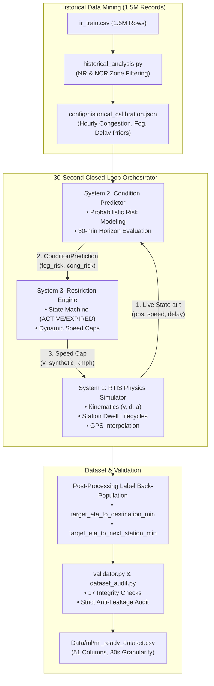

# Phase 6: Closed-Loop Synthetic & Historical Dataset Generator

## 1. Executive Summary

Phase 6 implements the **Closed-Loop Simulation and Dataset Generation Architecture** for the Indian Railways ETA Prediction System. 

It fuses **1.5+ million empirical records** from historical Indian Railways operations with a **physics-based kinematic simulator** (SI units) across the **New Delhi (NDLS) → Dehradun (DDN)** corridor (314.0 km). 

The generated dataset serves as the foundational ground truth for downstream feature engineering (Phase 7), machine learning model training (Phase 8), and comparative benchmarking (Phase 9).

---

## 2. System Architecture

Phase 6 connects three distinct operational systems in a real-time feedback loop executing every 30 seconds:



---

## 3. Component Breakdown & Source Modules

| Stage | Module Path | Purpose & Responsibilities |
| :--- | :--- | :--- |
| **1. Historical Analysis** | [`src/data_generator/historical_analysis.py`](file:///d:/Projects/railway/src/data_generator/historical_analysis.py) | Ingests `ir_train.csv` (1.5M rows), filters for Northern Railway (`NR`) and North Central (`NCR`) zones, and extracts empirical probability distributions for hourly congestion, seasonal fog, and primary delay causes. |
| **2. Calibration Matrix** | [`src/data_generator/calibration.py`](file:///d:/Projects/railway/src/data_generator/calibration.py) | Compiles extracted distributions into [`config/historical_calibration.json`](file:///d:/Projects/railway/config/historical_calibration.json), mapping risk levels to operational speed impact thresholds ($25\text{ km/h}$, $40\text{ km/h}$, $60\text{ km/h}$). |
| **3. System 2 Predictor** | [`src/data_generator/prediction_engine.py`](file:///d:/Projects/railway/src/data_generator/prediction_engine.py) | Ingests live state at timestamp $t$ and projects 30-min forward operational risks (congestion risk, fog risk, delay escalation risk). |
| **4. System 3 Decision Engine** | [`src/data_generator/restriction_engine.py`](file:///d:/Projects/railway/src/data_generator/restriction_engine.py) | State machine managing dynamic synthetic restrictions (`ACTIVE`, `UPDATED`, `EXPIRED`, `REMOVED`), outputting the effective synthetic speed constraint. |
| **5. Journey Orchestrator** | [`src/data_generator/dataset_builder.py`](file:///d:/Projects/railway/src/data_generator/dataset_builder.py) | Coordinates System 1, System 2, and System 3 every 30 seconds along the 314 km corridor, generates GPS telemetry, and back-populates ground truth target ETAs upon journey completion. |
| **6. Validation & Audit** | [`src/data_generator/validator.py`](file:///d:/Projects/railway/src/data_generator/validator.py) | Executes a 17-point consistency check and audits features to ensure zero future-state leakage. |

---

## 4. Operational Systems Interaction (Every 30 Seconds)

### Step 1: System 1 (State Extraction)
At simulation time $t$, System 1 extracts the physical train state:
- Current timestamp $t$, position $d_t$ (km), speed $v_t$ (km/h), current section, and delay against timetable schedule.

### Step 2: System 2 (Risk Prediction)
System 2 consumes state $t$ and historical calibration priors to generate a `ConditionPrediction`:
```python
@dataclass
class ConditionPrediction:
    prediction_timestamp: str       # "07:15:00"
    prediction_horizon_min: float   # 30.0 min
    congestion_risk: float          # 0.0 to 1.0 (from hourly matrix + delay stress)
    fog_risk: float                 # 0.0 to 1.0 (from seasonal prior + night multiplier)
    delay_risk: float               # 0.0 to 1.0 (weighted composite)
    expected_speed_impact: str      # "NONE" | "LIGHT" | "MEDIUM" | "SEVERE"
    predicted_condition_summary: str
    prediction_source: str          # "BASELINE_HISTORICAL_PRIOR"
```

### Step 3: System 3 (Restriction Decision)
System 3 checks prediction risks against calibration thresholds:
- If $\text{congestion\_risk} \ge 0.70 \rightarrow$ Imposes **$25\text{ km/h}$** speed cap (`SEVERE`).
- If $\text{congestion\_risk} \ge 0.45 \rightarrow$ Imposes **$60\text{ km/h}$** speed cap (`MEDIUM`).
- If $\text{fog\_risk} \ge 0.40 \rightarrow$ Imposes **$40\text{ km/h}$** speed cap (`FOG`).
- When conditions normalize $\rightarrow$ Transitions restriction to `EXPIRED` and restores speed.

### Step 4: System 1 (Kinematics & Advancement)
System 1 combines all speed constraints:
$$V_{\text{target}} = \min(V_{\text{section}}, V_{\text{signal}}, V_{\text{physical\_restriction}}, V_{\text{synthetic\_speed\_cap}})$$

Applies SI kinematic physics equations:
$$v_{t+1} = \max\left(0, v_t + a \Delta t\right)$$
$$d_{t+1} = d_t + v_t \Delta t + \frac{1}{2} a (\Delta t)^2$$
$$\text{Braking Distance } d_{\text{brake}} = \frac{v^2}{2 \cdot a_{\text{brake}}}$$

---

## 5. Post-Processing & Target Ground Truths

When the simulated train arrives at Dehradun (DDN) and terminates:
1. Exact actual arrival times for all stations along the corridor are resolved.
2. The orchestrator iterates backward through all 30-second observation rows to assign continuous ground truth targets:
   - `target_eta_to_destination_min`: Minutes remaining until actual train arrival at Dehradun terminal.
   - `target_eta_to_next_station_min`: Minutes remaining until actual train arrival at the immediate next scheduled station.
3. The dataset is exported to [`Data/ml/ml_ready_dataset.csv`](file:///d:/Projects/railway/Data/ml/ml_ready_dataset.csv) (51 schema-validated columns).

---

## 6. Strict Anti-Leakage Guarantee

To ensure ML models trained on this dataset generalize to live deployment:
- **Zero Future Information in Features**: All 24 input features available at timestamp $t$ depend solely on past and present observations ($t' \le t$).
- **Clean Label Separation**: Future knowledge is confined strictly to the two target columns (`target_eta_to_destination_min`, `target_eta_to_next_station_min`).
- **Audit Verification**: [`reports/dataset_validation_report.json`](file:///d:/Projects/railway/reports/dataset_validation_report.json) passes with 0 errors and `anti_leakage_audit: PASSED`.
