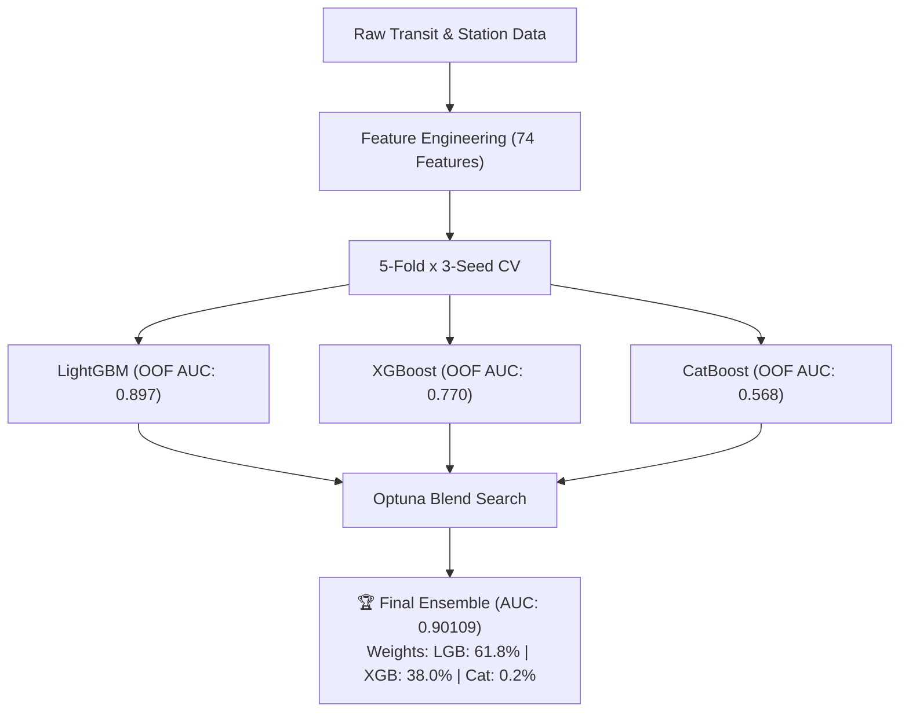

# Indian Railways ML Ensemble & ETA System Enhancement Guide

**Project**: Supernova / Indian Railways Train Delay & ETA Prediction System  
**Reference**: Kaggle Competition (*Indian Railways | Fast Multi-Seed Ensemble*)  
**File Location**: [docs/ML_ENSEMBLE_GUIDE.md](file:///d:/Supernova/docs/ML_ENSEMBLE_GUIDE.md)

---

## 📑 Quick Navigation
- [1. Executive Summary & Flow](#1-executive-summary--flow)
- [2. Blending vs. Stacking in Simple Terms](#2-blending-vs-stacking-in-simple-terms)
- [3. Key Feature Importance Ranking](#3-key-feature-importance-ranking)
- [4. Critical Flaws in the Kaggle Code & Fixes](#4-critical-flaws-in-the-kaggle-code--fixes)
- [5. Supernova Project Action Plan](#5-supernova-project-action-plan)
- [6. Production-Ready Code Templates](#6-production-ready-code-templates)

---

## 1. Executive Summary & Flow



---

## 2. Blending vs. Stacking in Simple Terms

### 🧑‍⚕️ The "Panel of 3 Doctors" Analogy
Imagine you ask 3 expert AI doctors (LightGBM, XGBoost, CatBoost) whether a train will be delayed.

| Method | How It Works | Kaggle Result | Strength |
|---|---|---|---|
| **Optuna Blend** | Finds optimal percentage weights ($w_1 A + w_2 B + w_3 C$) by running 300 rapid mathematical trials. | **0.90109 AUC** (Winner 🏆) | Very fast, simple, almost zero risk of overfitting. |
| **Stacking** | Trains a second model (Logistic Regression) that uses the 3 doctors' predictions as its input features. | **0.90106 AUC** | Can learn non-linear combination rules. |

---

## 3. Key Feature Importance Ranking

The LightGBM feature analysis identified the **top 10 predictors**:

1. **`speed_proxy`**: $\frac{\text{distance\_km}}{\text{scheduled\_travel\_hours} + 0.1}$ *(Schedule tightness)*
2. **`fleet_age`**: $0.5 \times \text{loco\_age} + 0.5 \times \text{coach\_age}$ *(Mechanical degradation)*
3. **`loco_age_years`**: Direct engine wear
4. **`otp_x_cong`**: $\text{historical\_delay\_rate} \times \text{congestion\_index}$ *(Bottleneck interaction)*
5. **`seat_utilisation_pct`**: Overcrowding platform boarding delays
6. **`train_number`**: Rake scheduling quirks & priority class
7. **`scheduled_travel_hours`**: Exposure time to disruptions
8. **`age_x_maint`**: $\text{fleet\_age} \times (1 - \text{maintenance\_score}/10)$ *(Compounding penalty)*
9. **`psr_per_100km`**: Permanent Speed Restriction density
10. **`route_historical_ontime_pct`**: Baseline route reliability

---

## 4. Critical Flaws in the Kaggle Code & Fixes

> [!CAUTION]
> Do **not** copy the Kaggle notebook verbatim into production without applying these 5 fixes:

1. **Exact Duplicate Feature**:
   - `cong_x_otp` is identical to `otp_x_cong` (commutative multiplication). **Fix**: Drop `cong_x_otp`.
2. **Temporal & Journey Data Leakage**:
   - `StratifiedKFold(shuffle=True)` mixes rows from the same journey between train and test sets. **Fix**: Use `GroupKFold(groups=journey_id)` or chronological date splits.
3. **Categorical Leakage**:
   - `LabelEncoder` fit on concatenated train + test. **Fix**: Fit strictly on train folds and map new unseen categories to `<UNK>`.
4. **CatBoost Underperformance**:
   - Scored 0.5677 and stalled on CPU. **Fix**: Enable GPU (`task_type='GPU'`) or replace with scikit-learn's fast `HistGradientBoostingClassifier`.
5. **Classification vs. ETA Regression**:
   - Kaggle only outputs binary probabilities. **Fix**: Use a 2-stage model: Probability of Delay $\times$ Predicted Delay Duration ($\Delta t$) to compute exact arrival timestamps.

---

## 5. Supernova Project Action Plan

```
Phase 6 (Data Generator)    ──► Enrich synthetic trains with loco/coach age and rake turnaround delays.
Phase 7 (Features)          ──► Implement speed_proxy, age_x_maint, and cyclic time transforms.
Phase 8 (ML Ensemble)       ──► Train LightGBM + XGBoost with GroupKFold and Optuna blending.
Phase 9 (ETA Engine)        ──► Connect live TrainState predictions to ETA dashboard & API.
```

---

## 6. Production-Ready Code Templates

Detailed, copy-paste-ready implementations of the Feature Transformer and GroupKFold Ensemble Trainer have been saved to [docs/ML_ENSEMBLE_GUIDE.md](file:///d:/Supernova/docs/ML_ENSEMBLE_GUIDE.md).
